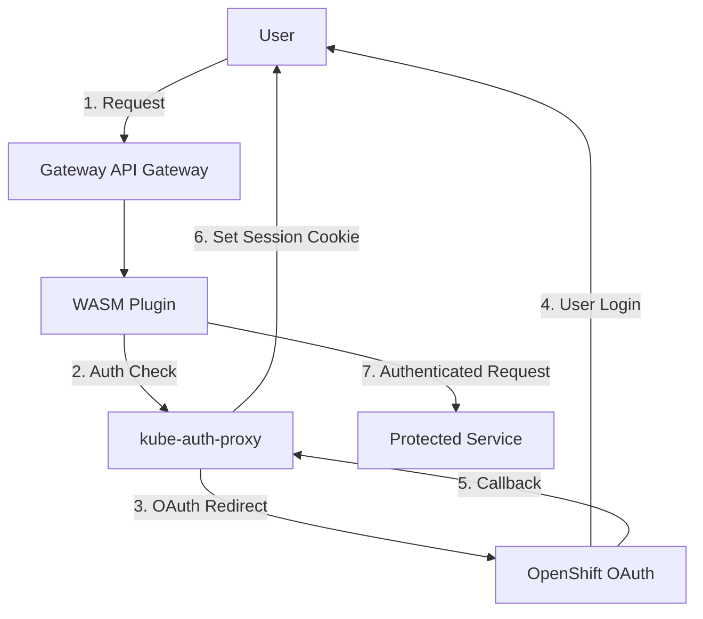

<p>
  
</p>

# BYOIDC WASM Plugin

**Bring Your Own Identity and Access (BYOIDC)** - A WebAssembly plugin for OpenShift Gateway API that integrates with existing OAuth/OIDC authentication services.

[](LICENSE)
[](https://docs.openshift.com/)
[](https://gateway-api.sigs.k8s.io/)

## Overview

This WASM plugin enables **session-based authentication** for OpenShift Gateway API by integrating with existing authentication services like [kube-auth-proxy](https://github.com/opendatahub-io/kube-auth-proxy/). Instead of replacing your proven authentication logic, it acts as a transparent bridge that forwards requests and handles OAuth flows.

### What it does

- **Reuses your existing auth services** - Works with kube-auth-proxy, oauth2-proxy, or anything that implements ext_authz endpoints
- **Standard Gateway API integration** - No vendor-specific extensions or custom resources
- **Session-based authentication** - Users log in once, get cookies, subsequent requests just work  
- **Actually works in production** - Running in OpenShift Data Hub and Red Hat OpenShift AI
- **Minimal complexity** - Just the WASM plugin capabilities, no full service mesh required

## How It Works



**Authentication Flow:**
1. User requests protected resource through Gateway
2. WASM plugin forwards request to authentication service for validation
3. If unauthenticated, user is redirected to OAuth provider (OpenShift, Google, etc.)
4. After successful login, session cookies are set
5. Subsequent requests use session cookies for authentication

## Quick Start

### Prerequisites

- OpenShift 4.19+ cluster (CRC supported)
- Gateway API resources (`oc get crd gateways.gateway.networking.k8s.io`)

### Basic Deployment

```bash
# 1. Clone repository
git clone <repository-url>
cd gateway-auth-wasm-plugin

# 2. Deploy infrastructure (Gateway, auth service, test app)
oc apply -f test-configs/

# 3. Deploy WASM plugin and routing
oc apply -f deploy/

# 4. Test authentication flow
curl -k -I https://odh-gateway.apps-crc.testing/
# Expected: 302 redirect to OAuth login
```

### Configuration Example

```yaml
apiVersion: extensions.istio.io/v1alpha1
kind: WasmPlugin
metadata:
  name: gateway-auth-wasm-plugin
  namespace: openshift-ingress
spec:
  selector:
    matchLabels:
      gateway.networking.k8s.io/gateway-name: odh-gateway
  phase: AUTHN
  priority: 1000
  url: oci://your-registry/gateway-auth-wasm-plugin:latest
  pluginConfig:
    auth_service:
      endpoint: "http://kube-auth-proxy.openshift-ingress.svc.cluster.local:4180"
      cluster: "outbound|4180||kube-auth-proxy.openshift-ingress.svc.cluster.local"
      verify_path: "/oauth2/auth"
      timeout: 5000
    global_auth:
      enabled: true
```

## Documentation

### 📚 **Getting Started**
- **[docs/REFERENCE_DEPLOYMENT.md](docs/REFERENCE_DEPLOYMENT.md)** - Complete CRC/OpenShift 4.19 deployment guide
- **[docs/CONFIGURATION.md](docs/CONFIGURATION.md)** - WASM plugin configuration reference
- **[DESIGN_DOC.md](DESIGN_DOC.md)** - Project design and architectural decisions

### 🔧 **Operations**  
- **[docs/DEPLOYMENT.md](docs/DEPLOYMENT.md)** - Production deployment scenarios
- **[docs/TROUBLESHOOTING.md](docs/TROUBLESHOOTING.md)** - Debug guide and common issues
- **[docs/SECURITY.md](docs/SECURITY.md)** - Security considerations and best practices

### 🛠️ **Development**
- **[docs/DEVELOPMENT.md](docs/DEVELOPMENT.md)** - Development setup and contribution guide
- **[docs/INTEGRATION.md](docs/INTEGRATION.md)** - Integrating with different auth services
- **[docs/TESTING.md](docs/TESTING.md)** - Testing strategies and validation

### 📖 **Reference**
- **[docs/API_REFERENCE.md](docs/API_REFERENCE.md)** - Complete parameter and schema reference
- **[docs/ARCHITECTURE.md](docs/ARCHITECTURE.md)** - Internal design and architecture

## Supported Authentication Services

| Service | Description | Status |
|---------|-------------|--------|
| **[kube-auth-proxy](https://github.com/opendatahub-io/kube-auth-proxy/)** | FIPS-compliant OAuth proxy for OpenShift Data Hub | Primary |
| **oauth2-proxy** | OAuth2 proxy for cloud identity providers | Compatible |
| **Custom ext_authz services** | Any service implementing ext_authz `/oauth2/auth` endpoint | Compatible |

## Compatibility

### OpenShift Versions
- **OpenShift 4.19** - Primary development and testing platform
- **OpenShift 4.18** - Compatible
- **OpenShift 4.20** - Validation in progress

### Authentication Providers  
- **OpenShift OAuth** - Native OpenShift authentication
- **Google OAuth** - Google identity provider
- **Azure AD** - Microsoft Azure Active Directory  
- **Keycloak/Red Hat SSO** - Enterprise identity management
- **Generic OIDC** - Any OpenID Connect compliant provider

## Build Requirements

**For Red Hat Service Mesh compatibility:**

```dockerfile
# Required Rust toolchain
FROM rustlang/rust:nightly

# Required compatibility label  
LABEL module.wasm.image/variant=compat
```

```toml
# Required proxy-wasm version
[dependencies]
proxy-wasm = "0.2.3"  # Exact version for OpenShift 4.19
```

See **[docs/CONFIGURATION.md](docs/CONFIGURATION.md)** for complete build requirements.

## Project Status

🎉 **Production Ready** - Successfully deployed and validated in:
- OpenShift Data Hub (ODH) environments
- Red Hat OpenShift AI (RHOAI) workloads  
- CRC (CodeReady Containers) development environments

**Test Coverage:**
- Unit tests (Rust)
- Integration tests (Browser-based OAuth flow validation)
- End-to-end testing (Complete authentication cycle)

## Contributing

We welcome contributions! See **[docs/DEVELOPMENT.md](docs/DEVELOPMENT.md)** for:
- Development environment setup
- Code contribution guidelines  
- Testing procedures
- Pull request process

### Quick Development Setup

```bash
# Setup Rust environment
rustup install nightly
rustup target add wasm32-unknown-unknown

# Build and test
make build-wasm-cargo
make test

# Deploy to test cluster
make deploy
```

## Support and Community

- **Issues**: [GitHub Issues](https://github.com/your-org/gateway-auth-wasm-plugin/issues)
- **Debugging**: See **[bugs/BUG_001.md](bugs/BUG_001.md)** for detailed troubleshooting journey
- **Questions**: Create a [GitHub Discussion](https://github.com/your-org/gateway-auth-wasm-plugin/discussions)

## License

This project is licensed under the GPL - see the [LICENSE](LICENSE) file for details.

## Related Projects

- **[kube-auth-proxy](https://github.com/opendatahub-io/kube-auth-proxy/)** - Primary authentication service integration
- **[OpenShift Data Hub](https://github.com/opendatahub-io)** - Machine learning platform using this plugin
- **[Gateway API](https://gateway-api.sigs.k8s.io/)** - Kubernetes-native ingress evolution

---

**Ready to get started?** → **[docs/REFERENCE_DEPLOYMENT.md](docs/REFERENCE_DEPLOYMENT.md)**
