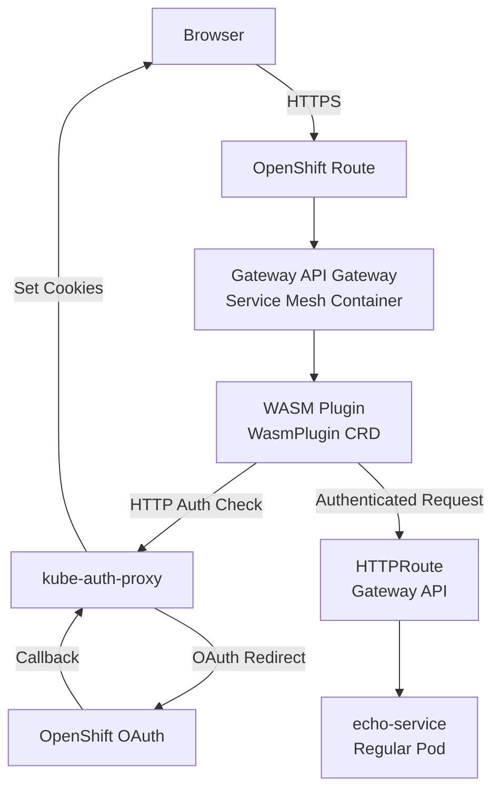

# BYOIDC WASM Plugin - CRC Reference Deployment

## Overview

This document provides a complete **reference deployment** for the BYOIDC WASM Plugin running on **single-node OpenShift 4.19** via **CRC (Code Ready Containers)**. This is a production-validated configuration that demonstrates full end-to-end OAuth authentication.

## Environment Specifications

- **Platform**: Red Hat CodeReady Containers (CRC) 2.x
- **OpenShift**: 4.19.x single-node cluster
- **Service Mesh Components**: CRDs and containers only (no mesh features used)
- **Gateway API**: OpenShift Gateway API implementation
- **Authentication**: OpenShift OAuth + kube-auth-proxy

## Prerequisites

### 1. CRC Installation and Setup

```bash
# Download and install CRC
# Follow: https://developers.redhat.com/products/openshift-local/overview

# Start CRC with sufficient resources
crc setup
crc start --cpus 8 --memory 16384

# Login as system:admin
eval $(crc oc-env)
oc login -u system:admin
```

### 2. Host Configuration

Add the following entry to your host machine's `/etc/hosts`:

```bash
# Replace <CRC-IP> with your CRC cluster IP (typically 192.168.130.11)
echo "<CRC-IP> odh-gateway.apps-crc.testing" | sudo tee -a /etc/hosts
```

**Find your CRC IP:**
```bash
crc ip
# Example output: 192.168.130.11
```

### 3. Service Mesh Components (Auto-Installed)

**Important**: You do **NOT** need to manually install the Service Mesh Operator. It gets automatically installed when you create the `GatewayClass` with the specific controller name in `test-configs/odh-gateway.yaml`:

```yaml
apiVersion: gateway.networking.k8s.io/v1
kind: GatewayClass
metadata:
  name: istio
spec:
  controllerName: openshift.io/gateway-controller  # This triggers auto-installation
```

**What gets auto-installed:**
- ✅ Service Mesh Operator (for CRDs and containers)
- ✅ `WasmPlugin` CRD (needed for WASM plugin deployment)
- ✅ Istio gateway containers (for request processing)

**What is NOT used:**
- ❌ Service mesh sidecars
- ❌ mTLS between services  
- ❌ Traffic management policies
- ❌ Service mesh observability features

**Result**: You get WASM plugin capabilities without the complexity of a full service mesh deployment.

## Deployment Process

### Phase 1: Infrastructure Components

Deploy core infrastructure using `test-configs/` directory:

```bash
# 1. Deploy Gateway API Gateway
oc apply -f test-configs/odh-gateway.yaml

# 2. Deploy OAuth2 Proxy (Authentication Service)  
oc apply -f test-configs/kube-auth-proxy.yaml

# 3. Deploy Test Echo Service (Protected Application)
oc apply -f test-configs/echo-service.yaml

# 4. Create OpenShift Route (External Access)
oc apply -f test-configs/route.yaml
```

### Phase 2: Authentication Plugin

Deploy WASM plugin and routing using `deploy/` directory:

```bash
# 1. Cross-Namespace Permissions (CRITICAL)
oc apply -f deploy/reference-grant.yaml

# 2. OAuth Path Routing (CRITICAL)
oc apply -f deploy/echo-httproute.yaml  

# 3. WASM Authentication Plugin
oc apply -f deploy/wasmplugin-production.yaml
```

**Alternative: Use Makefile**
```bash
# Build, push, and deploy in one command
make deploy
```

## Working Configuration Details

### kube-auth-proxy Configuration

**Key Arguments** (from `test-configs/kube-auth-proxy.yaml`):
```yaml
args:
- --provider=openshift
- --client-id=system:serviceaccount:openshift-ingress:kube-auth-proxy
- --client-secret-file=/var/run/secrets/kubernetes.io/serviceaccount/token
- --openshift-service-account=kube-auth-proxy
- --http-address=0.0.0.0:4180              # HTTP-only on port 4180
- --upstream=static://200                   # Return 200 for successful auth
- --redirect-url=https://odh-gateway.apps-crc.testing/oauth2/callback
- --email-domain=*
- --pass-access-token
- --pass-user-headers
- --set-xauthrequest
- --skip-provider-button                    # Direct OAuth redirects (CRITICAL)
```

**Service Configuration:**
```yaml
ports:
- name: http
  port: 4180
  targetPort: 4180
  protocol: TCP
```

### WASM Plugin Configuration

**Key Settings** (from `deploy/wasmplugin-production.yaml`):
```yaml
pluginConfig:
  auth_service:
    endpoint: "http://kube-auth-proxy.openshift-ingress.svc.cluster.local:4180"
    cluster: "outbound|4180||kube-auth-proxy.openshift-ingress.svc.cluster.local"  # Istio cluster name
    verify_path: "/oauth2/auth"             # ext_authz standard endpoint
    timeout: 5000
    tls:
      verify_cert: false                    # HTTP communication
```

### HTTPRoute Configuration

**OAuth Path Routing** (from `deploy/echo-httproute.yaml`):
```yaml
rules:
# Higher priority: OAuth paths → kube-auth-proxy  
- matches:
  - path:
      type: PathPrefix
      value: /oauth2/
  backendRefs:
  - name: kube-auth-proxy
    namespace: openshift-ingress
    port: 4180
# Lower priority: Everything else → echo-service
- matches:
  - path:
      type: PathPrefix  
      value: /
  backendRefs:
  - name: echo-service
    port: 80
```

### ReferenceGrant Configuration

**Cross-Namespace Access** (from `deploy/reference-grant.yaml`):
```yaml
metadata:
  namespace: openshift-ingress        # Target namespace (where kube-auth-proxy lives)
spec:
  from:
  - group: gateway.networking.k8s.io
    kind: HTTPRoute
    namespace: echo-service           # Source namespace (where HTTPRoute is)
  to:
  - group: ""
    kind: Service
    name: kube-auth-proxy
```

## Complete Authentication Flow

### 1. Initial Request
```
Browser → https://odh-gateway.apps-crc.testing/
```

### 2. WASM Plugin Authentication Check
```
WASM Plugin → GET http://kube-auth-proxy.openshift-ingress.svc.cluster.local:4180/oauth2/auth
Headers: cookie: (forwarded from browser)
Response: 401 Unauthorized (no valid session)
```

### 3. OAuth Initiation Redirect
```
WASM Plugin → 302 Redirect
Location: /oauth2/start

Browser → https://odh-gateway.apps-crc.testing/oauth2/start  
HTTPRoute → kube-auth-proxy:4180
kube-auth-proxy → 302 Redirect
Location: https://oauth-openshift.apps-crc.testing/oauth/authorize?...
```

### 4. User Authentication  
```
Browser → OpenShift OAuth Server
User → Enters credentials (developer/developer)
OAuth Server → 302 Redirect
Location: https://odh-gateway.apps-crc.testing/oauth2/callback?code=...
```

### 5. OAuth Callback Processing
```  
Browser → https://odh-gateway.apps-crc.testing/oauth2/callback
HTTPRoute → kube-auth-proxy:4180
kube-auth-proxy → Processes OAuth code → Sets session cookies → 302 Redirect
Location: /
```

### 6. Authenticated Access
```
Browser → https://odh-gateway.apps-crc.testing/
Headers: cookie: _oauth2_proxy_session=...; _oauth2_proxy_csrf=...

WASM Plugin → GET http://kube-auth-proxy:4180/oauth2/auth  
Headers: cookie: _oauth2_proxy_session=...; _oauth2_proxy_csrf=... (FORWARDED)
Response: 200 OK (valid session)

WASM Plugin → Allow request
HTTPRoute → echo-service:80
User → Sees protected content ✅
```

## Validation and Testing

### Manual Testing
```bash  
# 1. Test OAuth flow initiation
curl -k -v https://odh-gateway.apps-crc.testing/oauth2/start

# Expected: 302 redirect to OpenShift OAuth server
```

### Automated Integration Testing
```bash
# Run comprehensive browser-based test
cd tests/integration/
source ../../venv/bin/activate
pip install -r requirements.txt

python test-auth-flow.py --username developer --password developer --browser chrome

# Expected output:
# ✅ Test 1 PASSED: Initial Gateway Access  
# ✅ Test 2 PASSED: OAuth Login Form
# ✅ Test 3 PASSED: Post-Login Redirect
# 🎉 ALL TESTS PASSED (3/3)
```

## Critical Success Factors

### 1. 🍪 Cookie Forwarding (WASM Plugin)
```rust
// In src/lib.rs - ESSENTIAL for session-based auth
if let Some(ref cookie_value) = cookie_header {
    auth_headers.push(("cookie", cookie_value));
}
```

### 2. 🔧 Istio Cluster Naming
```yaml
# MUST use Istio service mesh cluster name format
cluster: "outbound|4180||kube-auth-proxy.openshift-ingress.svc.cluster.local"
```

### 3. 🛣️ OAuth Path Routing
```yaml
# OAuth paths MUST route to kube-auth-proxy, not protected service
- path:
    type: PathPrefix
    value: /oauth2/
  backendRefs:
  - name: kube-auth-proxy
```

### 4. 🔑 Cross-Namespace Permissions
```yaml
# ReferenceGrant MUST exist for HTTPRoute → Service access
# Deploy BEFORE HTTPRoute configuration
```

## Troubleshooting

### Common Issues

**1. WASM Plugin Load Failure**
```bash
# Check compatibility requirements
grep -A5 "FROM rustlang" Dockerfile
# Must be: rustlang/rust:nightly

grep "module.wasm.image/variant" Dockerfile  
# Must be: compat

grep "proxy-wasm" Cargo.toml
# Must be: "0.2.3"
```

**2. Authentication Loop After Login**
```bash
# Check cookie forwarding in WASM plugin
oc logs -n openshift-ingress deployment/router-default | grep cookie
# Should show: "Forwarding cookies to kube-auth-proxy"
```

**3. Cross-Namespace Access Denied**
```bash
# Verify ReferenceGrant exists
oc get referencegrant -n openshift-ingress
# Should show: allow-echo-to-kube-auth-proxy
```

**4. OAuth Redirect Loop**  
```bash
# Check HTTPRoute OAuth path routing
oc describe httproute -n echo-service
# /oauth2/* paths must route to kube-auth-proxy
```

## Service Status Verification

```bash
# Check all components are running
oc get pods -n openshift-ingress | grep -E "(router-default|kube-auth-proxy)"
oc get pods -n echo-service | grep echo-service  
oc get wasmplugin -n openshift-ingress
oc get httproute -n echo-service
oc get referencegrant -n openshift-ingress

# Verify external access
curl -k -I https://odh-gateway.apps-crc.testing/
# Should return 302 (redirect to OAuth)
```

## Architecture Summary

**Key Point**: This is **NOT** a service mesh deployment. It's using Gateway API with service mesh **containers and CRDs only**.



**Architecture Notes:**
- **No sidecars**: Services communicate directly (HTTP)
- **No mTLS**: Plain HTTP between internal services  
- **No traffic policies**: Simple routing via HTTPRoute
- **WASM capability**: Leveraged via auto-installed Service Mesh Operator

## Files Reference

- **Infrastructure**: `test-configs/*.yaml` (Gateway, auth service, test app)
- **Authentication**: `deploy/*.yaml` (WASM plugin, routing, permissions) 
- **Source Code**: `src/*.rs` (WASM plugin implementation)
- **Testing**: `tests/integration/test-auth-flow.py` (Automated validation)
- **Build**: `Makefile` (Containerized build and deployment)

---

**✅ Status**: This reference deployment is production-validated and ready for replication in any CRC environment with OpenShift 4.19.